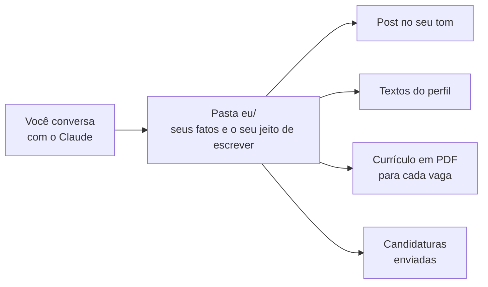
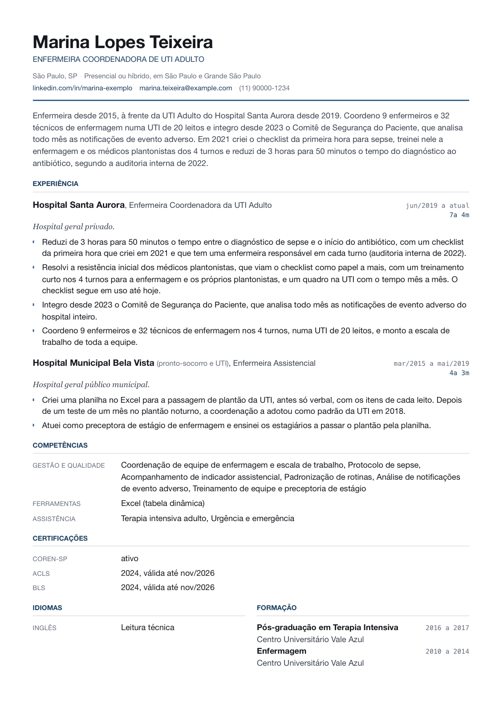
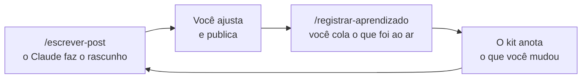
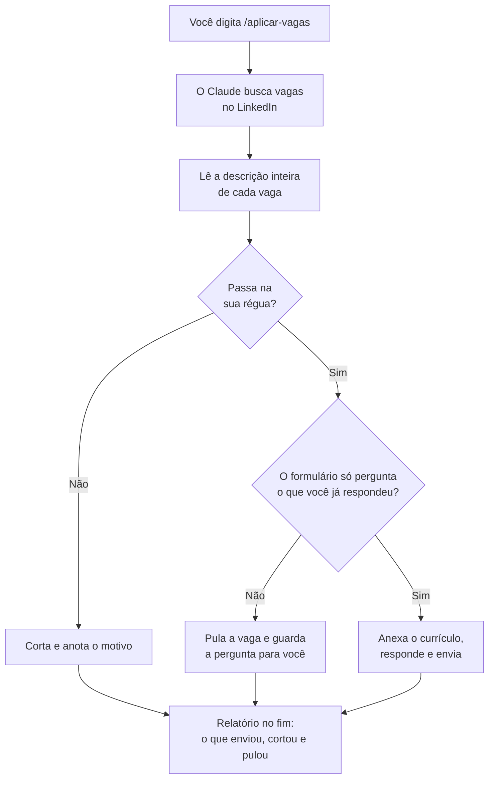

  

# linkedin-kit

**Você conversa. O Claude escreve o post, monta o perfil, gera o currículo e se
candidata às vagas, sempre com os seus fatos e do jeito que você fala.**

Serve para qualquer profissão, e não precisa saber programar. Você conta a sua
história uma vez, numa entrevista, e dali em diante pede o que quiser com um
comando curto.

---

## O que ele faz por você

| Você quer | Você digita | O que sai |
|---|---|---|
| Postar sem gastar uma hora | `/escrever-post` | Um post pronto para colar, no seu tom |
| Um perfil que conta bem a sua história | `/comecar` | Os textos do perfil, prontos para colar no LinkedIn |
| Um currículo para uma vaga específica | `/montar-cv` | Um PDF montado para aquela vaga |
| Se candidatar sem preencher formulário | `/aplicar-vagas` | Candidaturas enviadas às vagas que servem para você |

---

## Como funciona

Na primeira vez, o Claude faz uma entrevista com você: onde trabalhou, o que
fez, que resultado teve, como você costuma escrever. Tudo isso fica guardado
numa pasta chamada `eu/`, no seu computador. Depois, cada pedido seu é
atendido a partir dessa pasta.

Por isso **o Claude não inventa nada sobre você**. Um número, um cargo ou um
resultado só aparece se você contou. Quando falta uma informação, ele pergunta.

---

## Um exemplo do que sai

O kit vem com uma pessoa fictícia, a Marina, enfermeira coordenadora de UTI,
para você ver o resultado antes de começar. Os arquivos dela ficam em
`motor/exemplo/`.

**O começo de um post dela:**

> Em 2021, na UTI que eu coordeno, a gente levava 3 horas entre o diagnóstico
> de sepse e o antibiótico correr. Na auditoria interna de 2022, eram 50
> minutos.
>
> O que mudou foi um checklist da primeira hora, com o que tinha que acontecer
> em cada etapa. E cada turno ganhou uma dona: a enfermeira do turno responde
> pelo checklist no turno dela.

**O currículo dela, montado para uma vaga:**

  

---

## Como começar

1. Na página do kit no GitHub, clique no botão verde **Code** e depois em
   **Download ZIP**. Não precisa de conta no GitHub.
2. Descompacte o arquivo numa pasta onde você guarda documentos. Pode trocar o
   nome da pasta, por exemplo para `meu-linkedin`.
3. Abra essa pasta no app do Claude, na aba Code.
4. Digite `/comecar`. Na primeira vez, ele prepara a pasta sozinho: cria o
   histórico de versões do seu trabalho, que é o que permite receber as
   atualizações do kit sem perder nada.

A entrevista leva de 1 a 2 horas e pode ser feita em partes: dá para parar e
voltar outro dia. Dá para fazer sem ajuda ou com alguém do lado conduzindo; o
caminho é o mesmo.

Durante o uso, o Claude vai pedir licença antes de rodar cada comando (salvar
uma versão, gerar o PDF). É normal: leia o que ele diz que vai fazer e
autorize.

<strong>Já usa GitHub?</strong>

Dá para começar com **Use this template**, marcando **Private**, e abrir no
Claude o clone da sua cópia. O `/comecar` funciona igual, e o seu trabalho já
nasce com cópia de segurança. Um clone direto deste repositório também
funciona: o `/comecar` transforma o clone na sua cópia.

---

## O que você precisa

| Para | Você precisa de |
|---|---|
| Usar o kit | Assinatura paga do Claude e o app do Claude no computador |
| O kit funcionar | Python 3 e git, dois programas gratuitos |
| O currículo em PDF | Google Chrome ou Microsoft Edge |
| Candidatura automática (opcional) | Google Chrome com a extensão Claude in Chrome |
| Cópia de segurança (opcional) | Uma conta no GitHub |

<strong>Como instalar cada coisa</strong>

- **Assinatura do Claude** num plano pago (o Claude Code, que roda este kit,
  não está no plano gratuito).
- **O app do Claude no computador**, na aba Code.
- **Python 3 e git**, que o kit usa desde o primeiro comando. No Mac, se
  aparecer uma janela pedindo para instalar as "ferramentas de linha de
  comando", aceite: é isso que instala os dois. No Windows, instale o Python
  pelo site oficial (python.org) e o git pelo git-scm.com.
- **Para o CV em PDF:** Google Chrome ou Microsoft Edge, e a biblioteca PyYAML.
  O `/montar-cv` confere e explica como instalar o que faltar.
- **Opcional: uma conta no GitHub**, se você quiser uma cópia de segurança do
  seu trabalho fora do computador. Dá para começar sem e decidir depois.
- **Para o `/aplicar-vagas` (opcional):** o Google Chrome com a extensão
  **Claude in Chrome**, instalada pela Chrome Web Store e conectada à sua
  conta do Claude, e o LinkedIn logado nesse Chrome. O `/comecar vagas` confere
  e guia o que faltar.

---

## Os comandos

| Comando | Quando usar |
|---|---|
| `/comecar` | Na primeira vez, e para refazer uma parte quando algo mudar (`/comecar fatos` depois de um emprego novo, por exemplo). |
| `/escrever-post` | Quando quiser postar. |
| `/registrar-aprendizado` | Depois de publicar: você cola o que foi ao ar e o kit aprende com o que você mudou. |
| `/montar-cv` | Quando for se candidatar: você cola a vaga e sai o PDF. |
| `/aplicar-vagas` | Quando quiser que o Claude se candidate por você, sozinho, às vagas que passam na sua régua. Antes, uma vez: `/comecar vagas`. |
| `/atualizar` | Quando o Claude avisar, ao abrir uma conversa, que saiu versão nova do kit. |

---

## Ele aprende com você

O primeiro rascunho nunca sai perfeito, e você vai mexer nele antes de
publicar. O kit usa exatamente essas mudanças para melhorar: depois de
publicar, você cola o texto que foi ao ar, e ele anota o que você trocou. No
post seguinte, o rascunho já vem mais perto do seu jeito.

---

## Candidatura automática

  

Antes da primeira vez, o `/comecar vagas` monta com você três coisas: a
**régua** (a lista do que faz uma vaga servir e do que faz ela ser cortada),
as buscas, e as respostas para as perguntas que os formulários costumam fazer.

Depois, cada `/aplicar-vagas` faz este caminho sozinho, no seu navegador, nas
vagas de candidatura simplificada (aquelas em que dá para se candidatar sem
sair do LinkedIn):

Três cuidados que ele tem:

- **Não inventa resposta.** Se o formulário pergunta algo que você nunca
  respondeu, ele pula a vaga e guarda a pergunta para você responder depois.
- **A primeira vez para em 5 candidaturas**, para você conferir antes de
  deixar rodar mais.
- **Só se candidata.** Nunca manda mensagem e não segue ninguém.

> **Atenção:** o LinkedIn pode restringir uma conta que ele entende como
> automação. A decisão de correr esse risco é sua.

---

## Onde mexer

- **A pasta `eu/` é sua.** Tudo o que é seu mora ali, e nenhuma atualização
  mexe nela.
- **Não edite o motor:** `CLAUDE.md`, `README.md`, `.gitignore`,
  `.claude/settings.json`, `.claude/skills/` e `motor/`. A próxima atualização
  apagaria a sua mudança.
- **Discorda de uma regra?** Peça ao Claude para registrar a exceção em
  `eu/EXCECOES.md`. Ela vence a regra do motor, e a atualização não apaga.

---

## Privacidade

- **Os arquivos do seu trabalho ficam só no seu computador**, a não ser que
  você decida guardar uma cópia no GitHub. Nesse caso, o repositório precisa
  ser **privado**, e o Claude confere isso antes de enviar.
- Telefone, email e os PDFs do CV ficam **fora do git**, só no seu computador.
  O mesmo vale para CV antigo, PDF do perfil e export de dados do LinkedIn
  (`.pdf`, `.doc`, `.docx`, `.csv`, `.zip`) salvos dentro de `eu/`.
- **Cópia de segurança:** um computador perdido leva junto o que só estava
  nele. No fim da entrevista, o Claude explica como guardar uma cópia privada
  no GitHub, se você quiser.
- Nenhum documento (CPF, RG, dado bancário, senha) é pedido, em nenhum momento.
- **O `/aplicar-vagas` envia candidaturas em seu nome**, sozinho, e só quando
  você pede.

---

## Para quem mantém este kit

O passo a passo para publicar uma versão nova está em
[`motor/MANTER.md`](motor/MANTER.md).
